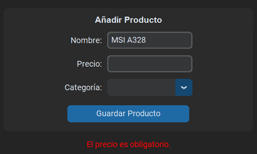
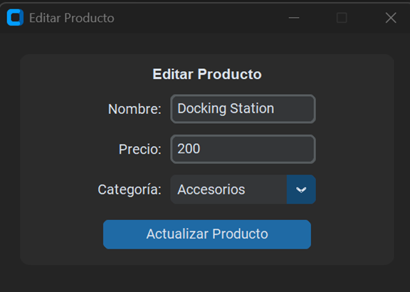
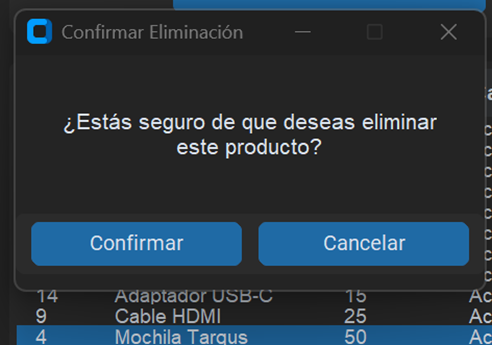

# Product Manager

This project is a simple application for product management, developed with Python and CustomTkinter to provide a modern and user-friendly interface. The application allows users to perform the following operations:

- **Add products**
- **Edit products**
- **Delete products**
- **View products in a table sorted by category**

## Main Features

1. **Modern Interface**: CustomTkinter is used to enhance aesthetics and user experience.
2. **Input Validations**: Ensures required fields are completed and input data is valid.
3. **Error and Confirmation Messages**: Provides clear and concise feedback to the user.
4. **SQLite Database**: Stores information in a database for easier management.

## Requirements

- Python 3.10 or higher
- Required packages:
  - customtkinter
  - sqlalchemy

To install the dependencies:
```bash
pip install -r requirements.txt
```

## Project Structure

```
ProductManager/
├── app.py             # Main application file
├── db.py              # Database configuration
├── models.py          # Database model definitions
├── database/         # Folder containing the SQLite database
│   └── products.db  # Database with example products
├── resources/        # Additional files like icons
└── __pycache__/      # Temporary files generated by Python
```

## Instructions for Use

1. **Run the application**:
   ```bash
   python app.py
   ```

2. **Add a product**:
   - Complete the form fields at the top.
   - Press "Save Product." The table will update automatically.

3. **Edit a product**:
   - Select a product from the table.
   - Press the "Edit" button. A popup window with the product's current data will appear.
   - Make the necessary changes and press "Update Product."

4. **Delete a product**:
   - Select a product from the table.
   - Press the "Delete" button.
   - Confirm the deletion in the popup window.

## Configurations
### Customizing Categories
The product categories displayed in the application can be customized. To modify the categories:

1. Open the `categories.json` file located in the root of the project.
2. Edit the list of categories to fit your needs.

**Example of `categories.json`:**
```json
{
  "categories": ["Electronics", "Furniture", "Groceries", "Books", "Clothing"]
}
``` 

## Validations and Messages

- **Name required**: The name input field is empty.
- **Product already exists**: The name already exists in the database.
- **Price required**: The price input field is empty.
- **Invalid price**: The price must be greater than 0.
- **Category required**: No category has been selected.

## Screenshots

### Add Product


### Edit Product


### Delete Product


## Considerations

The `products.db` database comes pre-configured with example products to facilitate initial testing of the application.

---
If you have any questions or suggestions, feel free to open an *issue* in the repository. Thank you for trying the Product Manager!

